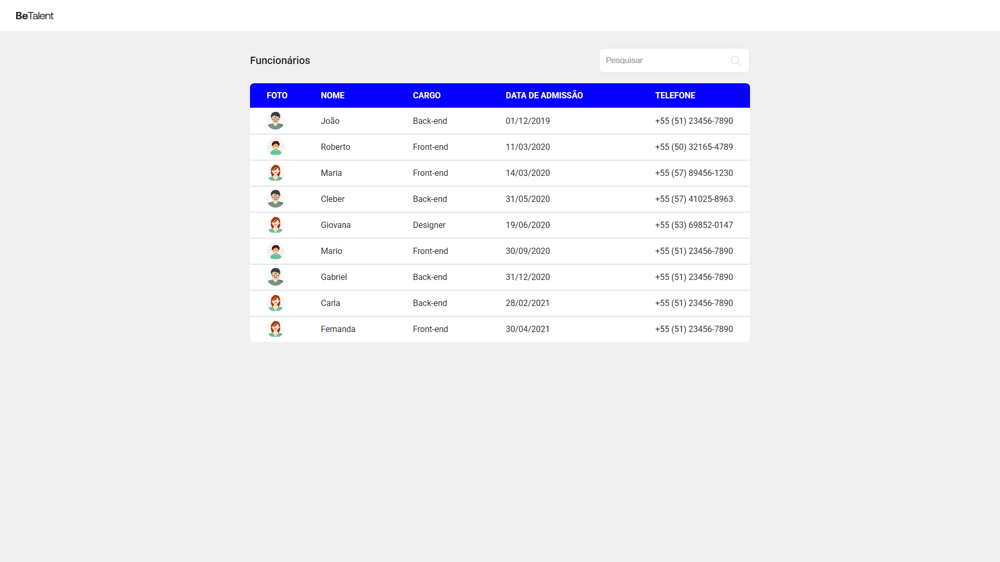

# Desafio Front-end - BeTalent



## Tecnologias usadas
- React.js
- TypeScript
- JSON Server
- ESLint / Prettier
- Yarn


## Como rodar o projeto localmente

1. **Clone o repositório** 
    ```bash
    git clone https://github.com/luiz2k/teste-tecnico-front-end-betalent
    ```

2. **Acesse a pasta do projeto**
    ```bash
    cd teste-tecnico-front-end-betalent
    ```

3. **Instale as dependências**
    ```bash
    yarn install
    ```

4. **Inicie a API fake**
    ```bash
    yarn server
    ```

5. **Crie o arquivo de variáveis de ambiente**  
No diretório raiz, copie o arquivo `.env.example` para `.env` e edite as variáveis conforme necessário:
    ```bash
    cp .env.example .env
    ```

6. **Faça a build do projeto**
    ```bash
    yarn build
    ```

7. **Inicie o projeto**
    ```bash
    yarn preview
    ```
